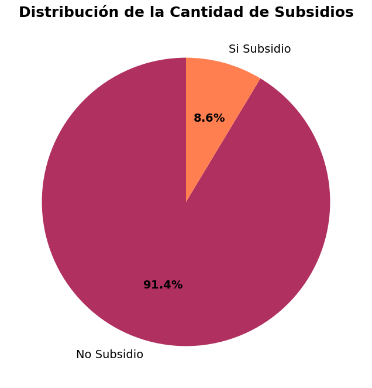
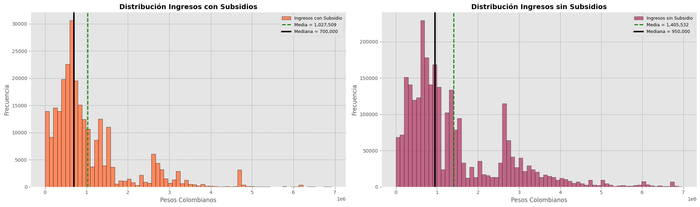
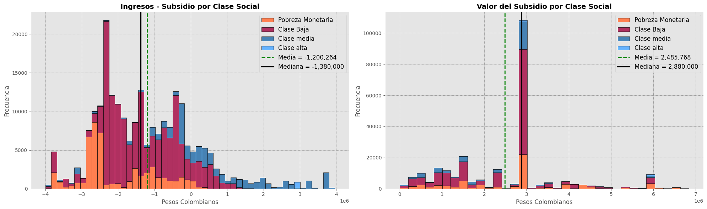

# Colombia Subsidy ML (GEIH)

A professional, reproducible MLOps-style project built on Colombia’s GEIH household survey to study whether subsidies reduce inequality and to predict potential subsidy candidates under extreme class imbalance. The original exploratory notebooks are preserved in `notebooks/`, while the production path is modularized into pipelines, configs, and CLI tools.

---

## Table of Contents
1. Overview
2. Descriptive Analysis (Selected Figures)
3. Project Structure
4. Data & Inputs
5. Pipelines & CLI
6. Modeling Approach
7. Configuration
8. Artifacts & Outputs
9. Tests
10. Docker
11. Notebooks
12. Roadmap

---

## 1. Overview
This repository delivers:
- A dataset build pipeline that consolidates raw GEIH tables into a modeling-ready file.
- Feature engineering and preprocessing in a reusable package.
- A two-stage cascade model optimized for recall/precision tradeoffs on the minority class.
- Anomaly detection baselines (Isolation Forest / One-Class SVM) for high-precision targeting.
- Config-driven training, evaluation, and inference from the command line.

---

## 2. Descriptive Analysis (Selected Figures)
Below are selected figures extracted from the original descriptive notebook. These are intentionally curated (not all plots) and laid out for readability.

<table>
  <tr>
    <td>
      
    </td>
    <td>
      
    </td>
  </tr>
  <tr>
    <td>
      
    </td>
    <td>
      
    </td>
  </tr>
</table>

---

## 3. Project Structure
```
.
├─ artifacts/                 # model artifacts (ignored by git)
├─ configs/                   # YAML configs for data & models
├─ data/
│  ├─ raw/                    # raw GEIH tables (CSV.rar or extracted CSVs)
│  └─ processed/              # consolidated modeling dataset
├─ docs/assets/               # images used in README
├─ notebooks/                 # original exploratory notebooks
├─ scripts/                   # thin CLI wrappers
├─ src/colombia_subsidy_ml/    # package (pipelines, models, utils)
├─ tests/                     # pytest
├─ Dockerfile
├─ pyproject.toml
└─ README.md
```

---

## 4. Data & Inputs
- **Raw GEIH tables** should be placed in `data/raw/`.
- Expected file names (see `configs/dataset.yaml`):
  - `generales.csv`
  - `laborales.csv`
  - `hogar.csv`
  - `subsidios.csv`
  - `fuerza_trabajo.csv`
  - `desempleados.csv`
- The consolidated dataset is saved to `data/processed/Base_Modelo_Subsidios.csv`.

---

## 5. Pipelines & CLI
You can run everything from the CLI (no notebooks required).

### Install
```bash
pip install -e .
```

### Build dataset
```bash
python -m colombia_subsidy_ml build-dataset --config configs/dataset.yaml
```

### Train cascade model
```bash
python -m colombia_subsidy_ml train --config configs/train_cascade.yaml
```

### Evaluate
```bash
python -m colombia_subsidy_ml evaluate --config configs/train_cascade.yaml
```

### Predict
```bash
python -m colombia_subsidy_ml predict \
  --config configs/train_cascade.yaml \
  --input data/processed/Base_Modelo_Subsidios.csv \
  --output artifacts/predictions.csv
```

---

## 6. Modeling Approach
### Two-Stage Cascade (Supervised)
- **Stage 1**: High-recall classifier (XGBoost) to filter candidates.
- **Stage 2**: Precision-focused classifier (Random Forest) refines candidates.
- Thresholds are configurable and can be tuned to meet recall constraints.

### Anomaly Detection (Unsupervised)
- **Isolation Forest** and **One-Class SVM** treat subsidy recipients as anomalies.
- Provides a high-precision option when false positives are costly.

---

## 7. Configuration
All training and inference behavior is controlled in YAML:
- `configs/dataset.yaml`: raw table mapping and processing output path.
- `configs/train_cascade.yaml`: train/val/test split, preprocessing, SMOTE, model params.
- `configs/train_anomaly.yaml`: anomaly model configuration.

---

## 8. Artifacts & Outputs
Artifacts are written to `artifacts/`:
- `preprocessor.joblib`
- `stage1_model.joblib`
- `stage2_model.joblib`
- `metadata.json`
- `metrics.json`
- `split_indices.npz`

---

## 9. Tests
```bash
pytest -q
```

---

## 10. Docker
```bash
docker build -t colombia-subsidy-ml .
docker run --rm -v "$PWD":/app colombia-subsidy-ml \
  python -m colombia_subsidy_ml train --config configs/train_cascade.yaml
```

---

## 11. Notebooks
Original notebooks remain available for reference:
- `notebooks/Subsidy Analysis.ipynb`
- `notebooks/Full Maching Learning Modeling.ipynb`

---

## 12. Roadmap
- Add experiment tracking (MLflow or Weights & Biases).
- Add data validation (Great Expectations).
- Add model registry and versioning.
- Add CI pipeline for tests and linting.

---

## License
Apache License 2.0
